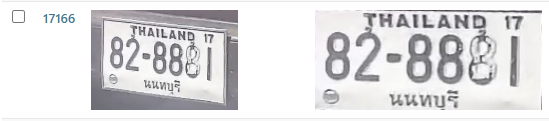

# ANPR-Showcase

**Note:** This repository showcases a project I was responsible for while working at my company.

This is a Django-based web application designed for car detection and **Automatic Number Plate Recognition (ANPR)**. It is specifically tailored for use in authorized barrier control systems.

## Tools and Frameworks for Development

## Features

### **Live Video Streaming**
Stream real-time video from RTSP-enabled IP cameras for live monitoring through a web browser.

### **Vehicle Detection and License Plate Recognition**
The backend processes video frames from the live stream, detecting vehicles and extracting their details. This includes: 
- `Vehicle` and `license plate` images
- `Brand`, `color`, and `license plate number` information

### **Multiple Frames Processing**
During license plate recognition, multiple video frames are processed to verify the `license plate number` accurately.

### **Automatic Perspective**
All detected license plates are preprocessed to correct perspective orientation before processing license plate number recognition.

### **Region of Interest Customization and Filtering**
Users can set a region of interest to limit the area for detecting vehicles. Additionally, smaller detected vehicles can be filtered out to save processing resources.

### **Data Collection**
All detected vehicles are saved into a database.

> **Note:** Django [officially](https://docs.djangoproject.com/en/5.1/ref/databases/) supports the following databases: `PostgreSQL`, `MariaDB`, `MySQL`, `Oracle`, and `SQLite`. Additionally, there are [third-party](https://docs.djangoproject.com/en/5.1/ref/databases/#third-party-notes) database backends.
