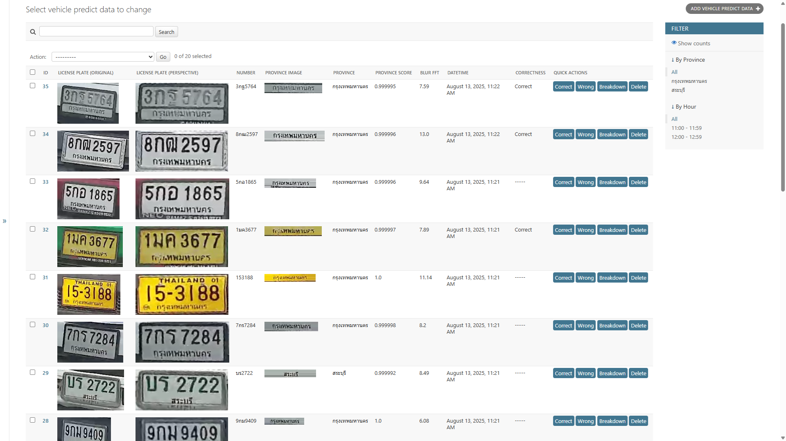

# ANPR-Showcase

> **Note**: This repository showcases a project I led during my worktime at company.

This project began as a Django-based web application designed for **real-time Automatic Number Plate Recognition (ANPR)**. The system automates the detection and identification of vehicles. During my time at company, the system is adapted to integrate with barrier control systems for access management. Additionally, the solution was optimized for deployment on **Raspberry Pi 5**.

## Tools and Frameworks for Development

## Features

### **Live Video Streaming**
Stream real-time video from RTSP-protocol IP cameras directly to the web-based live monitoring

### **Vehicle Detection and License Plate Recognition**
The backend processes video frames from the live stream to detect vehicles and extract key details, including:

- Images of **vehicle** and **license plate**
- Vehicle's **brand**, **color**, and **license plate number**

> **Supported Brands**
    

    
    
    
    
    
    
    
    
    
    
    
    
    
    
    
    
    
    
    
    

### **Enhanced Accuracy with Multiple Frame Processing**
To ensure reliability, the system processes multiple video frames during license plate recognition, cross-verifying results to achieve a higher accuracy in recognizing **license plate number**.

### **Automatic Perspective Correction**
Detected license plates are automatically preprocessed to correct perspective distortions, improving the accuracy of recognition results.

### **Region of Interest Customization and Filtering**
Users can define a region of interest to limit detection to a specific area of the video frame. The system also allows filtering out smaller detected vehicles to optimize processing resources.

### Comprehensive Data Management
All detected vehicle details are stored in a database. Users can review and label the data as **correct** or **wrong**, providing valuable feedback to improve the system's performance in future.

> **Note**: Django [officially](https://docs.djangoproject.com/en/5.1/ref/databases/) supports several databases, including **PostgreSQL**, **MariaDB**, **MySQL**, **Oracle**, and **SQLite**. For other databases, [third-party](https://docs.djangoproject.com/en/5.1/ref/databases/#third-party-notes) backends are available.

## Screenshots

### **Processing Breakdown Visualization**

This screenshot showcases the detailed breakdown of the system's processing workflow. It highlights how each vehicle and license plate is detected, recognized, and processed step by step.

### **Database View (License Plate Number Recognition)**

The database view provides a centralized interface for managing recognized license plate information.

### **Data Labeling Interface**

The data labeling interface allows users to review and label recognition results as either **correct** or **wrong**. This feedback improves the accuracy of the system over time by enhancing the underlying models.

### **Data Dashboard**

The dashboard interface allows users to review and summarize the recognition system's accuracy after data labeling. Note that, it displays only approved data.

