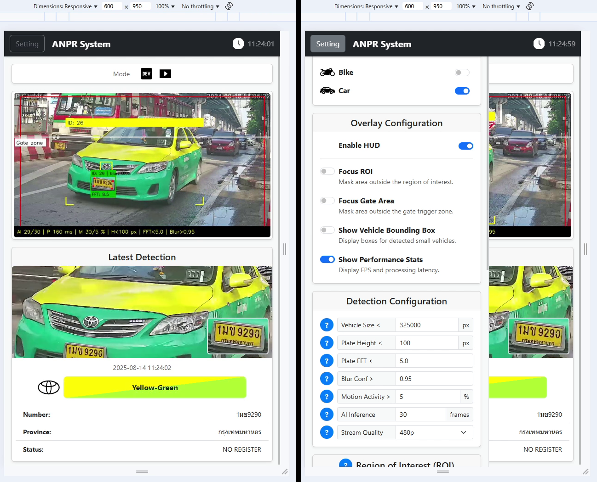
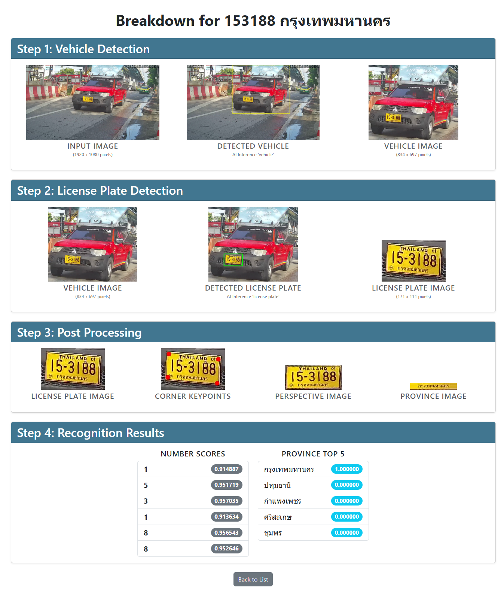
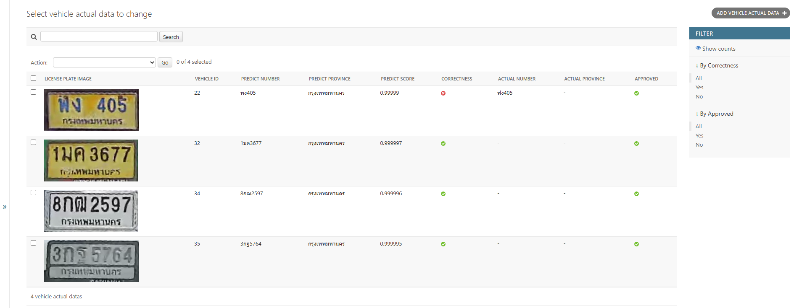

# Real-time Vehicle Detection & License Plate Recognition System

*Gif image please wait*

> **Portfolio Showcase**: This repository contains documentation for a project I developed and led during my employment. Therefore, source code is not available. This `README` serves as a detailed showcase of the system's architecture, features, and technical implementation.

## Project Overview

This project is a **real-time Automatic Number Plate Recognition (ANPR) system**, developed as a full-stack Django web application. Its core function is to process live video streams from IP cameras (via RTSP) to automatically detect vehicles and extract key information, including their **brand**, **color**, and **license plate number**.

The application’s frontend provides a web interface for users to monitor the live video feed and review detection results in real-time. In parallel, the backend continuously runs AI inferences, processing video frames from the IP cameras to identify vehicles and their attributes.

## Tech Stack

The system is built with a modern, full-stack architecture, leveraging specialized tools for each layer of the application.

### Backend

  
  

### AI & Computer Vision

  
  
  

### Frontend

  
  
  
  
  

### Databases & Caching

  
  
  

### Deployment & Infrastructure

  
  

## System Architecture & Key Features

This section details both the architecture that powers the system and the key features it provides to the end-user.

### Architectural Design

**High-Performance Multi-threaded Pipeline**:
To ensure smooth real-time performance, the backend operates on a multi-threaded architecture. This design separates concerns, allowing tasks to run concurrently without blocking the main application:

- **Video Capture Thread**: Connects to the RTSP stream and continuously fetches frames.
- **AI Inference Thread**: Performs vehicle/plate detection and recognition on video frames.
- **Real-time Broadcasting Thread**: Pushes results to the web UI via WebSockets for live monitoring.
- **System Health Thread**: Monitors performance and reports status, also via WebSockets.

**Data Collection & Labeling for Model Improvement**:
The application includes an optional **Dataset Mode** designed to generate high-quality data for training improved AI models. When this mode is activated:

-   The system automatically saves all prediction results, including cropped images of vehicles and license plates, to database.
-   A built-in web interface allows operators to review, correct, and validate this saved prediction data.
-   This workflow provides a powerful, self-contained tool for creating clean, verified datasets ready for model retraining.

### Core Features

**Comprehensive Vehicle Analysis**:
The backend processes video frames to detect vehicles and extract key details, including:
-   High-resolution images of the **vehicle** and **license plate**.
-   Vehicle's **brand**, **color**, and **license plate number**.

> **Supported Brands:**
> 

> 
> 
> 
> 
> 
> 
> 
> 
> 
> 
> 
> 
> 
> 
> 
> 
> 
> 
> 
> 

**Advanced Accuracy Enhancement Techniques**:
To ensure reliability, especially with challenging camera angles or motion blur, several techniques were implemented:
-   **Multi-Frame Processing:** The system cross-verifies recognition results from multiple consecutive frames to determine the most accurate license plate number.
-   **Automatic Perspective Correction:** Detected license plates are automatically de-skewed and warped to a straight-on perspective before character recognition, significantly improving accuracy.

## Project Evolution & Impact

Beyond its core design, the project's success is defined by its adaptability and integration into a commercial environment.

### Deployment Journey: From Edge to Server
The project demonstrates adaptability across different hardware environments:
-   **Prototype Phase:** Initially deployed on a **Raspberry Pi**, using the **NCNN** framework for CPU-optimized inference on an edge device.
-   **Production Phase:** Evolved into a scalable solution **containerized with Docker**, designed for deployment on production Linux servers.

### Commercial Integration
The application was successfully integrated as the core ANPR engine for the commercial **Venus Sentinel** security platform. To achieve this, its architecture was specifically adapted for headless operation and inter-service communication:

1.  **Configuration Web Interface**: For the commercial product, the application provided a secure, staff-only web UI used exclusively for initial system setup and configuration during deployment. Once configured, the application runs as a headless background service.

2.  **Backend REST API**: To enable communication with the main platform's backend, my application's architecture was expanded to include a REST API. This API serves as the data bridge, transmitting real-time detection results—including plate number, vehicle details, and timestamp to the platform, which in turn triggers automated actions like opening gate barriers.

This integration was a collaborative effort, developed in close cooperation with other teams within the company.

## System Visuals

### Responsive Design
To provide a great user experience on any device, the web interface uses a responsive design. The page layout and navigation automatically adjust for the best view, whether on large desktop monitors, tablets, or small mobile screens.

**Desktop & Tablet View**
On large screens, the interface utilizes the available space to display information in a multi-column layout for easy navigation and data visibility.

**Mobile View**
On mobile devices, the layout transforms into a single-column, touch-friendly format. The navigation collapses and content is stacked vertically for easy scrolling.

### Live Status Monitoring
The application's main navigation bar also works as a live status display. This design helps operators quickly see important system information. Using WebSockets, the system sends live data to the bar, showing key metrics like:
-   The number of active viewers on the page.
-   An overall system health indicator.
-   The status of the connected camera stream.
-   A synchronized system clock.

### License Plate Processing Pipeline

This view provides a detailed breakdown of the license plate recognition pipeline. It visualizes each step, from video frame to plate number recognition, offering full transparency into the AI's process.

### Data Management & Labeling Workflow
The application includes a powerful workflow for creating high-quality datasets when **Dataset Mode** is active. This process involves two main interfaces shown below.

**Database View**
This interface provides a complete, searchable log of all vehicle data captured by the system. Operators can quickly see every entry with its saved images and the AI's predicted information, serving as the central hub for data management.

**Data Labeling Interface**
From the database, each entry can be opened in the labeling interface. Here, an operator can carefully review the AI's results, mark them as `correct` or `wrong`, and manually fix any errors in the recognized text. This step is critical for creating the clean, human-verified datasets needed for future model improvement.

